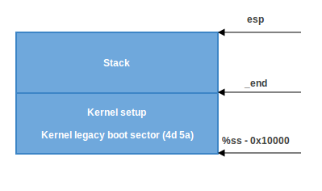
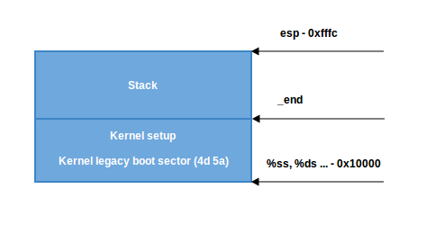
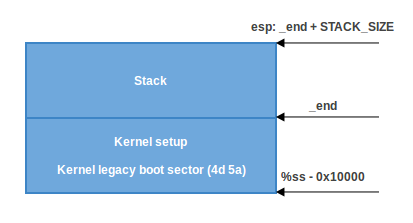
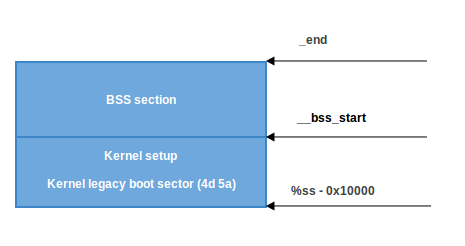

커널 부팅 과정. Part 1
================================================================================

부트로더에서 커널까지
--------------------------------------------------------------------------------

만약 당신이 제 이전 [블로그 게시물](https://0xax.github.io/categories/assembler/)들을 계속 읽어왔다면, 제가 꽤 오랜 시간동안 로우레벨 프로그래밍을 해왔다는 것을 알 수 있었을 것입니다. 저는 x86_64 리눅스에 대한 어셈블리 프로그래밍에 대한 여러 글들을 작성해왔고, 그와 동시에 리눅스 커널 소스 코드에 빠져들게 되었습니다.

저는 로우레벨이 어떻게 내부적으로 동작하는지, 프로그램이 컴퓨터에서 어떻게 실행이 되는지, 어떻게 그것들이 메모리에 적재되는지, 커널이 프로세스와 메모리 관리를 어떻게 하는지, 네트워크 스택이 로우레벨에서 어떻게 동작하는지, 그리고 이외의 많은 것들을 이해하는데 큰 관심을 가지고 있습니다. 그래서 저는 **x86_64** 아키텍쳐 리눅스 커널에 대해 게시물 시리즈를 작성하기로 결정하였습니다.

제가 전문적인 커널 해커가 아니고 일하면서 커널 코드를 작성하지 않는다는 것을 알아두세요. 이건 취미일 뿐이고, 저는 단지 로우레벨과 이것들이 어떻게 동작하는지 흥미가 있기 때문에 하는 것입니다. 만약에 글을 읽다가 헷갈리는 것이 생기거나 궁금한 사항 등이 생기면 트위터에서 [0xAX](https://twitter.com/0xAX)를 핑하거나 [이메일](anotherworldofworld@gmail.com)을 보내거나 아니면 [이슈]를 만들어주세요. 감사히 받겠습니다.

모든 게시물들은 [github repo](https://github.com/0xAX/linux-insides)에서 볼 수 있습니다. 그리고 제 영어 실력이나 게시물 내용에서 이상한 것을 찾으면 언제든 풀 리퀘스트를 보내주세요.

*이 게시물은 공식 문서가 아니며, 단지 지식을 배우고 공유하기 위한 것임을 알아두세요.*
**요구 지식**

* C언어를 이해할 수 있는 능력
* 어셈블리어(AT&T 문법)를 이해할 수 있는 능력

어쨌든, 이런 도구를 처음으로 배우기 시작했으면, 그런 분들을 위해 앞으로의 게시물들에서 제가 여러 파트를 설명할 수 있도록 노력할 것입니다.
자, 이제 간단한 소개가 끝났습니다. 이제 리눅스 커널과 로우레벨에 뛰어들 수 있겠군요.

제가 리눅스 커널 버전 3.18 때부터 이 게시물을 작성하기 시작했는데, 그 이후로 많은 부분들이 바뀌었습니다. 변경 사항이 생기면 그에 따라 게시물들을 업데이트하겠습니다.

마법의 컴퓨터 전원 버튼을 누르면 무슨 일이 벌어지나요?
--------------------------------------------------------------------------------

비록 이 시리즈의 포스트들이 리눅스 커널에 대한 것일지라도, 우리는 바로 커널 코드부터 시작하지 않을 것입니다. 적어도 이 단락에서는요. 

노트북 또는 데스크톱 컴퓨터에 있는 마법의 전원 버튼을 누르면, 컴퓨터와 노트북은 바로 작동하기 시작합니다. 메인보드는 파워 서플라이에 신호를 보냅니다. 신호를 받고 나면, 파워 서플라이는 컴퓨터에 적절한 양의 전력을 제공하기 시작합니다. 메인보드가 [파워 양호 신호(Power good signal)] (https://en.wikipedia.org/wiki/Power_good_signal) 을 받고 나면, 메인보드는 CPU 시작을 시도합니다. CPU는 모든 레지스터에 남아있던 데이터를 초기화하고, 각각에 미리 정의된 값들을 설정합니다. 

80386 CPU 이상에서 컴퓨터 리셋 이후 CPU 레지스터에 들어갈 미리 정의된 값들은 다음을 따릅니다:

```
IP          0xfff0
CS selector 0xf000
CS base     0xffff0000
```

프로세서는 [리얼 모드](https://ko.wikipedia.org/wiki/리얼_모드) 에서 작동을 시작합니다. 조금 뒤로 물러나서, 이 모드에서의 [메모리 세그먼트 방식](https://ko.wikipedia.org/wiki/메모리_세그먼트)을 조금만 이해해봅시다. 
리얼모드는 [8086](https://ko.wikipedia.org/wiki/인텔_8086)에서부터 최신의 인텔 64bit CPU까지, 모든 x86 호환 프로세서에서 지원됩니다. 
`8086` 프로세서는 20비트 주소 버스를 가지고 있어서, `0-0xFFFFF` 또는 `1 메가바이트` 주소 공간으로 동작할 수 있었습니다. 하지만 8086은 오직 `2^16 - 1`, 또는 `0xffff`(64 KB)의 최대 주소를 갖는 `16비트` 레지스터밖에 가지고 있지 않았습니다.

[메모리 세그먼트 방식](https://ko.wikipedia.org/wiki/메모리_세그먼트)은 사용 가능한 모든 주소 공간을 이용하는데 쓰였습니다. 모든 메모리는 `65535` 바이트(64 KB) 의 일정한 크기를 가진 작은 세그먼트로 나누어집니다. 16비트 레지스터로는 `64 KB` 이상의 주소를 만들 수 없기 때문에 이러한 대체 방법을 고안하게 되었습니다.

주소는 두 파트로 구성됩니다: 주소를 가지고 있는 세그먼트 셀렉터, 그리고 기준 주소로부터의 오프셋. 리얼모드에서 세그먼트 셀렉터의 관련하는 기준 주소는 `세그먼트 셀렉터 * 16` 입니다. 따라서 메모리의 물리 주소를 얻기 위해서는, 이것에 세그먼트 셀렉터에 16을 곱하고 오프셋을 더해주어야 합니다:

```
물리주소 = 세그먼트 셀렉터 * 16 + 오프셋
```

예를 들어, 만약 `CS:IP` 가 `0x2000:0x0010`이면, 해당하는 물리주소는 아래와 같습니다:

```python
>>> hex((0x2000 << 4) + 0x0010)
'0x20010'
```

하지만, 만약 우리가 `0xffff:0xffff`와 같이 가장 큰 세그먼트 셀렉터와 오프셋을 갖는다면, 결과는 이렇게 될 것 입니다:

```python
>>> hex((0xffff << 4) + 0xffff)
'0x10ffef'
```

`65520` 바이트가 첫 메가바이트를 넘어가 버립니다. 따라서 오직 1MB까지만 접근 가능한 리얼모드에서, [A20 라인](https://en.wikipedia.org/wiki/A20_line)이 비활성화 되어 있을때 `0x10ffef`는 `0x00ffef`가 되어버립니다.
 
좋습니다, 이제 우리는 리얼모드와 이 모드에서의 메모리 주소 지정에 대해서 조금 알게 되었습니다. 다시 리셋 이후의 레지스터 값에 대한 논의로 돌아갑시다.

`CS` 레지스터는 두 파트로 구성됩니다: 보이는 세그먼트 셀렉터(visible segment selector), 그리고 숨겨진 기준 주소(hidden base address). 기준 주소는 일반적으로 세그먼트 셀렉터 값에 16을 곱하여 형성되지만, 하드웨어가 리셋되는 동안에는 CS 레지스터의 세그먼트 셀렉터에 `0xf000`이 로드되고, 기준 주소에는 `0xffff0000`이 로드됩니다; 프로세서는 `CS`의 값이 바뀌기 전까지는 이 특별한 기준 주소를 사용합니다.

시작 주소는 EIP 레지스터의 값에 기준 주소를 더함으로써 형성됩니다.


```python
>>> 0xffff0000 + 0xfff0
'0xfffffff0'
```

우리는 4GB의 16바이트 아래인 `0xfffffff0`을 얻었습니다. 이 지점은 [리셋 벡터](https://en.wikipedia.org/wiki/Reset_vector)라고 불립니다. 이곳은 CPU가 리셋 후 실행할 첫 번째 명령어가 있을 것이라 예상하는 메모리 위치입니다. 이 명령은 보통 BIOS 진입 지점을 가리키고 있는 [점프](https://en.wikipedia.org/wiki/JMP_%28x86_instruction%29) (`jmp`) 명령을 포함하고 있습니다. 예로써 [coreboot](https://www.coreboot.org/)의 소스코드(`src/cpu/x86/16bit/reset16.inc`)를 보면, 우리는 다음과 같은 코드를 볼 수 있습니다.:

```assembly
    .section ".reset", "ax", %progbits
    .code16
.globl	_start
_start:
    .byte  0xe9
    .int   _start16bit - ( . + 2 )
    ...
```

여기서 우리는 `jmp` 명령어의 [기계어 코드](http://ref.x86asm.net/coder32.html#xE9)인 `0xe9`를 볼 수 있습니다, 그리고 목적지 주소는 `_start16bit - ( . + 2)` 입니다.

우리는 또한 `reset` 섹션의 `16` 바이트를 볼 수 있습니다. 그리고 그것은 `0xfffffff0` 주소에서 시작하기 위해 컴파일 됩니다. (`src/cpu/x86/16bit/reset16.ld`):

```
SECTIONS {
    /* Trigger an error if I have an unuseable start address */
    _bogus = ASSERT(_start16bit >= 0xffff0000, "_start16bit too low. Please report.");
    _ROMTOP = 0xfffffff0;
    . = _ROMTOP;
    .reset . : {
        *(.reset);
        . = 15;
        BYTE(0x00);
    }
}
```

이제 바이오스가 시작되었습니다; 하드웨어 초기화와 검사가 끝난 후에, 바이오스는 부팅 가능한 디바이스를 찾아야 합니다. 부팅 순서는 BIOS 설정에 저장되어 있으며, BIOS가 부팅을 시도하는 장치를 제어합니다. 하드 드라이브로부터 부팅을 시도할때, 바이오스는 부트 섹터를 찾으려 시도합니다. [MBR 파티션 레이아웃](https://ko.wikipedia.org/wiki/마스터_부트_레코드) 으로 파티션된 하드 드라이브에서 각 섹터가 `512` 바이트일때, 부트 섹터는 첫 섹터의 첫 `446` 바이트에 저장됩니다. 첫 섹터의 마지막 두 바이트는 `0x55`와 `0xaa` 입니다. 이는 BIOS에게 부팅 가능한 장치라는 것을 알려주기 위해 디자인 되었습니다.

예를 들어:

```assembly
;
; Note: this example is written in Intel Assembly syntax
;
[BITS 16]

boot:
    mov al, '!'
    mov ah, 0x0e
    mov bh, 0x00
    mov bl, 0x07

    int 0x10
    jmp $

times 510-($-$$) db 0

db 0x55
db 0xaa
```

이렇게 빌드하고 실행하면:

```
nasm -f bin boot.nasm && qemu-system-x86_64 boot
```

이를 통해 QEMU에게 디스크 이미지로 방금 우리가 만든 부팅 바이너리를 사용하도록 지시할 수 있습니다. 어셈블리 코드에 의해 생성된 바이너리는 부트 섹터의 요구사항(위치 카운터가 `0x7c00` 설정 되었으며, 매직 시퀀스로 끝남)을 충족하기 때문에, QEMU는 이 바이너리를 디스크 이미지의 마스터 부트 레코드 (MBR)로 다룹니다.

당신은 아래와 같이 보게 될것입니다:
You will see:


이 예제에서, 우리는 코드가 `16-bit` 리얼 모드에서 실행되며, 메모리의 `0x7c00`에서 시작한다는 것을 알 수 있습니다. 시작하고 난 후, 코드는 단순히 `!`를 출력하는 [0x10](http://wwww.ctyme.com/intr/rb-0106.htm) 인터럽트를 호출합니다; 나머지 `510` 바이트를 0으로 채우고, 매직 바이트 `0xaa`와 `0x55`로 끝납니다.

당신은 `objdump` 유틸리티를 사용하여 바이너리 덤프를 볼 수 있습니다.:

```
nasm -f bin boot.nasm
objdump -D -b binary -mi386 -Maddr16,data16,intel boot
```

실제 부트 섹터는 많은 0과 감탄사 대신에 부팅 프로세스와 파티션 테이블을 계속하기 위한 코드를 가지고 있습니다. 이 시점부터 BIOS는 부트로더에게 제어를 넘겨줍니다.

**주**: 위에 설명되어 있듯이, CPU는 리얼모드에 있습니다; 리얼모드에서는, 물리주소를 계산하기 위해 아래의 공식을 따릅니다:

```
PhysicalAddress = Segment Selector * 16 + Offset
```

위에 설명한 것과 똑같습니다. 우리는 16비트 범용 레지스터밖에 가지고 있지 않습니다.; 16비트 레지스터의 최대 값은 `0xffff`입니다. 따라서 우리가 가장 큰 값을 가진다면, 결과는 다음과 같이 될 것입니다:

```python
>>> hex((0xffff * 16) + 0xffff)
'0x10ffef'
```

여기서 `0x10ffef`는 `1MB + 64KB - 16b` 와 같습니다. [8086]((https://ko.wikipedia.org/wiki/인텔_8086) 프로세서 (리얼 모드를 지원하는 첫 번째 프로세서)는 그에 반해서, 20비트 주소 라인을 가지고 있었습니다. 따라서 `2^20 = 104876` 은 1MB 이므로, 사실상 사용 가능한 메모리가 1MB 라는 뜻이 됩니다.

일반적으로, 리얼 모드의 메모리 맵은 다음과 같습니다:

```
0x00000000 - 0x000003FF - 리얼 모드 인터럽트 벡터 테이블
0x00000400 - 0x000004FF - BIOS 데이터 구역 
0x00000500 - 0x00007BFF - 사용되지 않음 (Unused)
0x00007C00 - 0x00007DFF - 우리의 부트로더 
0x00007E00 - 0x0009FFFF - 사용되지 않음 (Unused)
0x000A0000 - 0x000BFFFF - 비디오 램 메모리 (VRAM)
0x000B0000 - 0x000B7777 - 흑백 비디오 메모리 
0x000B8000 - 0x000BFFFF - 컬러 비디오 메모리
0x000C0000 - 0x000C7FFF - 비디오 롬 BIOS (Video ROM BIOS)
0x000C8000 - 0x000EFFFF - BIOS 그림자 구역 (BIOS Shadow Area)
0x000F0000 - 0x000FFFFF - 시스템 BIOS
```

이 글의 시작에서, 저는 CPU에서 실행되는 첫 번째 명령어가 `0xFFFFFFF0`에 위치한다고 했었습니다, 이는 `0xFFFFF` (1MB) 보다 더 큰 주소입니다. CPU는 리얼모드에서 어떻게 이 주소에 접근하는 것일까요? 정답은 [coreboot](https://wwww.coreboot.org/Developer_Manual/Memory_map) 문서에 있습니다.

```
0xFFFE_0000 - 0xFFFF_FFFF: 128 킬로바이트 롬이 주소 공간에 맵핑됨 (128 kilobyte ROM mapped into address space)
```

실행이 시작되었을 때, BIOS는 RAM이 아닌 ROM에 위치합니다.


부트로더
--------------------------------------------------------------------------------
[GRUB 2](https://wwww.gnu.org/software/grub/)와 [syslinux](http://www.syslinux.org/wiki/index.php/The_Syslinux_Project)와 같이 리눅스를 부팅시킬 수 있는 많은 부트로더가 있습니다. 리눅스 커널은 리눅스 지원 시행을 위해 부트로더의 요구사항을 명시해놓은 [부트 프로토콜(Boot protocol)](https://github.com/torvalds/linux/blob/v4.16/Documentation/x86/boot.txt)을 가지고 있습니다. 이 예제에서는 GRUB2를 설명 할 것입니다.

계속하기 전에, `BIOS`가 부팅 장치를 선택하고 부트 섹터 코드로 제어권을 넘겨준 지금, 실행은 [boot.img](http://git.savannah.gnu.org/gitweb/?p=grub.git;a=blob;f=grub-core/boot/i386/pc/boot.S;hb=HEAD)에서 시작합니다. 이 코드는 공간의 제한으로 인해 매우 간단하며, GRUB2 코어 이미지의 위치로 점프하는데 사용하기 위한 포인터를 포함하고 있습니다. 코어 이미지는 [diskboot.img](http://git.savannah.gnu.org/gitweb/?p=grub.git;a=blob;f=grub-core/boot/i386/pc/diskboot.S;hb=HEAD)로 시작하는데, 이 이미지는 보통 첫 번째 파티션 이전의 사용되지 않는 공간(unused space) 첫 번째 섹터 바로 뒤에 저장됩니다. 위의 코드는 GRUB2의 커널과 파일 시스템 처리를 위한 드라이버를 포함하고 있는 나머지 코드 이미지를 메모리에 로드합니다. 나머지 코드의 로딩 이후에는 [grub_main](http://git.savannah.gnu.org/gitweb/?p=grub.git;a=blob;f=grub-core/kern/main.c) 함수를 실행시킵니다.

`grub_main` 함수는 콘솔을 초기화하고, 모듈을 위한 기준 주소를 얻고, 루트 디바이스 설정하며, grub 설정 파일 로드/분석하고, 모듈 로드 등을 합니다. 실행이 끝나면 `grub_main` 함수가 grub를 normal mode로 이동시킵니다. `grub_normal_execute` 함수 (`grub-core/normal/main.c`의 소스코드 파일에 위치)는 최종 준비를 완료하고 운영체제 선택을 위한 메뉴를 보여줍니다. 우리가 grub 메뉴 항목들 중 하나를 선택하면 `grub_menu_excecute_entry` 함수가 실행되어 grub `boot` 명령을 실행하고 선택한 운영체제를 부팅합니다.

우리가 커널 부트 프로토콜(kernel boot protocol)에서 읽을 수 있듯이, 부트로더는 반드시 커널 구성 코드(kernel setup code)의 `0x01f1` 오프셋에서 시작하는 커널 구성 헤더(kernel setup header)의 일부 필드를 읽고 채워야 합니다. 당신은 부트 [링커 스크립트](https://github.com/torvalds/linux/blob/v4.16/arch/x86/boot/setup.ld) 에서 이 오프셋의 값을 확인할 수 있습니다. 커널 헤더[arch/x86/boot/header.S](https://github.com/torvalds/linux/blob/v4.16/arch/x86/boot/header.S)는 다음과 같이 시작합니다.

```assembly
    .globl hdr
hdr:
    setup_sects: .byte 0
    root_flags:  .word ROOT_RDONLY
    syssize:     .long 0
    ram_size:    .word 0
    vid_mode:    .word SVGA_MODE
    root_dev:    .word 0
    boot_flag:   .word 0xAA55
```

부트로더는 반드시 이 것과 헤더의 나머지 부분(Linux 부트 프로토콜에서 오직 `write` 타입으로 표시된 것만, [이 예시와 같이](https://github.com/torvalds/linux/blob/v4.16/Documentation/x86/boot.txt#L354)) 을 커맨드 라인으로부터 받았거나 부팅 중에 계산된 값으로 채워야 합니다. (지금은 커널 구성 헤더의 모든 필드에 대한 모든 설명을 하지는 않을 것입니다, 하지만 우리는 커널이 이것을 어떻게 사용하는지에 대해 논의할 때 할 것입니다; 모든 필드에 대한 설명은 [부트 프로토콜](https://github.com/torvalds/linux/blob/v4.16/Documentation/x86/boot.txt#L156)에서 찾을 수 있습니다.)


커널 부트 프로토콜에서 볼 수 있듯이, 커널이 로딩된 후 메모리는 이렇게 맵핑 될 것입니다.
-------------------------------------------------------------------------------------------------------------------

```셸
         | 보호모드 커널           |
100000   +------------------------+
         | 입출력 메모리 홀        |
0A0000   +------------------------+
         | BIOS를 위해 제공됨      | 가능한 한 많이 사용하지 말고 미사용으로 내버려 두세요.
         ~                        ~
         | 커맨드 라인             | (X+10000 표시 이하일 수도 있습니다.)
X+10000  +------------------------+
         | 스택 / 힙               | 커널 리얼모드를 위해 사용 됩니다.
X+08000  +------------------------+
         | 커널 구성               | 커널 리얼모드 코드.
         | 커널 부트 섹터          | 기존 부트 섹터 커널.
       X +------------------------+
         | 부트로더                | <- 부트 섹터 진입 지점 0x7C00
001000   +------------------------+
         | MBR/BIOS를 위해 제공됨  |
000800   +------------------------+
         | 일반적으로 MBR에게 사용됨|
000600   +------------------------+
         | BIOS만 사용 가능        |
000000   +------------------------+

```

자, 부트로더가 커널에게서 제어권을 넘겨 받았을 때에는 여기서 부터 시작합니다:

```
X + sizeof(KernelBootSector) + 1
```

여기서 X는 로드되고 있는 커널 부트 섹터의 주소입니다. 제 경우에는 메모리 덤프에서 볼 수 있듯이 `X`는 `0x10000`입니다.


이제 부트로더는 리눅스 커널을 메모리에 로드했습니다, 헤더 필드들을 채웠고, 그러고 나서는 해당하는 메모리 주소로 점프했습니다. 우리는 이제 바로 커널 구성 코드로 이동 할 수 있습니다.

커널 구성 단계의 시작
--------------------------------------------------------------------------------

마침내, 저희가 커널에 있습니다! 기술적으로, 아직 커널은 실행되지 않았지만요; 첫번째로 커널 구성 부분은 반드시 압축해제, 그리고 몇몇 메모리 관리와 관련된 것과 같은 것들을 설정해야 합니다. 이 모든 것들이 끝난 후에, 커널 구성 부분은 실제 커널을 압축 해제하고 그곳으로 점프할 것입니다. 구성 부분의 실행은 [arch/x86/boot/header.S](https://github.com/torvalds/linux/blob/v4.16/arch/x86/boot/header.S) 의 [_start](https://github.com/torvalds/linux/blob/v4.16/arch/x86/boot/header.S#L292) 심볼에서 시작합니다.


이 전의 몇 가지 지침들이 처음 볼 때는 좀 이상하게 보일 수도 있습니다. 오래 전에 리눅스 커널은 자체 부트로더를 가지고 있었습니다. 하지만 지금, 예를 들어 아래 명령어를 실행하면.

```
qemu-system-x86_64 vmlinuz-3.18-generic
```

이런걸 볼 수 있습니다:


사실, `header.S` 파일은 매직 넘버[MZ](https://en.wikipedia.org/wiki/DOS_MZ_executable) (위에 사진을 보세요) 로 시작합니다. 에러 메세지는 그걸 보여줍니다. [PE](https://en.wikipedia.org/wiki/Portable_Executable) 헤더:

```assembly
#ifdef CONFIG_EFI_STUB
# "MZ", MS-DOS header
.byte 0x4d
.byte 0x5a
#endif
...
...
...
pe_header:
    .ascii "PE"
    .word 0
```

이것은 운영체제를 [UEFI](https://en.wikipedia.org/wiki/Unified_Extensible_Firmware_Interface)로 로드하려면 필요한 것입니다. 저희는 지금 당장 그게 어떻게 동작하는지 들여다 보진 않을 것이고, 다음 장에서 그것에 대해 다룰 것입니다.

실제 커널 구성 진입 지점은 아래와 같습니다:

```assembly
// header.S line 292
.globl _start
_start:
```

사실 `header.S`가 오류 메세지를 출력하는 `.bstext`섹션에서 부터 시작해도, 부트로더(grub2와 기타 등등)는 이 지점(`MZ`로부터 `0x200` 오프셋)을 알고 바로 점프합니다.  

```
//
// arch/x86/boot/setup.ld
//
. = 0;                    // current position
.bstext : { *(.bstext) }  // put .bstext section to position 0
.bsdata : { *(.bsdata) }
```

커널 구성 지점 포인터는:

```assembly
    .globl _start
_start:
    .byte  0xeb
    .byte  start_of_setup-1f
1:
    //
    // rest of the header
    //
```
 
우리는 여기서 `start_of_setup-1f` 지점으로 점프하는 `jmp` 명령의 기계어 코드(`0xeb`) 를 볼 수 있습니다. `Nf` 표기법에서 `2f`는 로컬 레이블인 `2:` 를 지칭하는 것입니다. 우리의 경우에는 점프 직후 나오는 레이블 `1` 이며, 이는 나머지의 구성 [헤더
](https://github.com/torvalds/linux/blob/v4.16/Documentation/x86/boot.txt#L156)를 포함하고 있습니다. 구성 헤더 바로 뒤에서, 우리는 `start_of_setup` 라벨에서 시작하는 `.entrytext` 섹션을 확인할 수 있습니다.

이것은 실질적으로 실행되는(당연히 이전의 점프 명령과는 별개입니다.) 첫 코드입니다. 커널 구성 부분이 부트로더부터 제어권을 넘겨 받으면, 첫 번째 `jmp` 명령이 커널 리얼모드 시작 지점(즉, 첫 512바이트 이후)부터 `0x200` 오프셋에 위치합니다. 이것은 Linux 커널 부트 프로토콜과 grub2 소스코드 모두에서 확인할 수 있습니다.

```
segment = grub_linux_real_target >> 4;
state.gs = state.fs = state.es = state.ds = state.ss = segment;
state.cs = segment + 0x20;
```

제 경우에, 커널은 `0x10000`에 로드 되었습니다. 말인 즉슨, 세그먼트 레지스터는 반드시 커널 구성 시작 이후에 다음과 같은 값을 가질 것이라는 것입니다:

```
gs = fs = es = ds = ss = 0x10000
cs = 0x10200
```

`start_of_setup`로 점프한 이후에, 커널은 다음과 같은 것들을 수행해야합니다:


* 모든 세그먼트 레지스터 값들이 확실히 같게 할 것.
* 올바른 스택을 구성할 것, 필요하다면.
* [bss](https://en.wikipedia.org/wiki/.bss)를 구성할 것.
*  [arch/x86/boot/main.c](https://github.com/torvalds/linux/blob/v4.16/arch/x86/boot/main.c)의 C코드로 점프할 것.

어떻게 구현되었나 한번 살펴봅시다.

세그먼트 레지스터 정렬 
--------------------------------------------------------------------------------

모든것에 앞서서, 커널은 `ds` 와 `es` 세그먼트 레지스터가 같은 주소를 가리키게 만들어야 합니다. 다음으로는 `cld` 명령을 사용하여 방향 플래그(Direction flag)를 클리어 합니다.

```assembly
    movw    %ds, %ax
    movw    %ax, %es
    cld
```

앞서 작성했듯이, `grub`는 그 실행이 파일의 시작부터 이루어지지 않기 때문에, 커널 구성 코드를 `0x10000`에 로드하고, `CS`에는 `0x10200`를 로드하여야 합니다. 따라서 [4d 5a](https://github.com/torvalds/linux/blob/v4.16/arch/x86/boot/header.S#L46)로 부터 `512` 바이트 떨어진 이 곳으로 점프하여 시작합니다:

```assembly
_start:
    .byte 0xeb
    .byte start_of_setup-1f
```

또한 우리는 `CS` 와 다른 모든 세그먼트 레지스터들을 0x10200에서 0x10000로 정렬 할 필요가 있습니다. 그 후에는 스택을 설정합니다:

```assembly
    pushw   %ds
    pushw   $6f
    lretw
```

위 코드는 `DS`의 값을 스택에 저장한 다음, [6](https://github.com/torvalds/linux/blob/v4.16/arch/x86/boot/header.S#L602)라벨의 주소를 지정하고 `lretw` 명령을 실행합니다. `lretw` 명령이 호출되면, `6` 라벨의 주소를 [명령 포인터](https://en.wikipedia.org/wiki/Program_counter)레지스터에 로드하고, `cs`에 `ds`의 값을 로드하게 됩니다. 이후, `ds`와 `cs`는 같은 값을 가지게 됩니다.

스택 구성
--------------------------------------------------------------------------------
대부분의 구성 코드는 리얼모드에서의 C언어 환경을 위해 준비하는 것입니다. 다음 [단계](https://github.com/torvalds/linux/blob/v4.16/arch/x86/boot/header.S#L575)는 `ss` 레지스터의 값을 확인하고, 만약 `ss`가 잘못되어 있다면 올바른 스택을 만들어 주는 것입니다:

```assembly
    movw    %ss, %dx
    cmpw    %ax, %dx
    movw    %sp, %dx
    je      2f
```

이 코드에서는 3개의 상황이 발생할 수 있습니다.

* `ss`가 유효한 값 `0x1000`을 가지고 있다. (`cs`와 다른 모든 세그먼트 레지스터들과 마찬가지로.)
* `ss`가 유효하지 않으며 `CAN_USE_HEAP` 플래그가 설정되어 있다. (아래 참고)
* `ss`가 유효하지 않으며 `CAN_USE_HEAP` 플래그가 설정되어 있지 않다. (아래 참고)

차례대로 이 세 가지의 상황에 대해 살펴봅시다:

* `ss`가 유효한 값 (`0x1000`)을 가지고 있습니다. 이 경우에는, 라벨 [2](https://github.com/torvalds/linux/blob/v4.16/arch/x86/boot/header.S#L589)로 이동합니다.

```assembly
2:  andw    $~3, %dx
    jnz     3f
    movw    $0xfffc, %dx
3:  movw    %ax, %ss
    movzwl  %dx, %esp
    sti
```

여기서 우리는 `dx`(부트로더에 의해 주어진 `sp`의 값을 가지고 있음.)를 4바이트로 정렬하고, 0인지 아닌지를 확인합니다. 만약 0이라면, `0xfffc`(64KB의 최대 세그먼트 크기 이전의 4바이트로 정렬된 주소)를 `dx`에 넣습니다. 만약 0이 아니라면, 우리는 부트로더에 의해 주어진 `sp`의 값을 계속 사용합니다. (제 경우에는 0xf7f4 였습니다). 이 이후에, `ax`의 값을 `ss`에 넣어 올바른 세그먼트 주소인 `0x1000`를 저장하고, 올바른 `sp`를 구성합니다. 
우리는 이제 올바른 스택을 가지게 되었습니다:



* 두 번째 상황인 (`ss` != `ds`) 입니다. 첫번째로, `dx`에 [_end](https://github.com/torvalds/linux/blob/v4.16/arch/x86/boot/setup.ld)(구성 코드의 끝 주소)를 넣습니다. 그리고는 `testb` 명령을 사용하여 `loadflags` 헤더 필드를 확인해 힙을 사용할 수 있는지 없는지 확인합니다. [loadflags](https://github.com/torvalds/linux/blob/v4.16/arch/x86/boot/header.S#L320)는 비트마스크 헤더입니다. 정의부는 아래와 같습니다.

```C
#define LOADED_HIGH     (1<<0)
#define QUIET_FLAG      (1<<5)
#define KEEP_SEGMENTS   (1<<6)
#define CAN_USE_HEAP    (1<<7)
```

부트 프로토콜에서도 읽을 수 있습니다:

```
Field name: loadflags

  This field is a bitmask.

  Bit 7 (write): CAN_USE_HEAP
    Set this bit to 1 to indicate that the value entered in the
    heap_end_ptr is valid.  If this field is clear, some setup code
    functionality will be disabled.
    
필드 이름: loadflags
  
 이 필드는 비트마스크입니다.
 
 Bit 7 (읽기): CAN_USE_HEAP
 이 비트를 1로 설정하여 heap_end_ptr에 입력된 값이 유효하다는 것을 나타냅니다
 만약 이 비트가 설정되지 않는다면, 구성 코드의 몇몇 기능이 비활성화 될 것입니다.
 
```

만약 `CAN_USE_HEAP` 비트가 설정되어 있다면, `dx` (`_end`를 가리키고 있음)에 `heap_end_ptr`을 넣게 되고, 여기에 `STACK_SIZE`(최소 스택 사이즈, `1024` 바이트)를 더하게 됩니다. 만약 `dx`가 자리올림 되지 않을 경우 (자리올림 되지 않을 것입니다. `dx = _end + 1024`), 라벨 `2`로 점프합니다 (이전의 경우와 같습니다). 그리고 올바른 스택을 만듭니다.



* `CAN_USE_HEAP`이 설정되어 있지 않을때에는, 그냥 `_end`에서 `_end + STACK_SIZE` 까지의 최소 스택을 사용합니다:




BSS 구성
--------------------------------------------------------------------------------
메인 C 코드로 점프하기 전에 해야 할 마지막 두 단계는 [BSS](https://en.wikipedia.org/wiki/.bss)섹션을 구성하는 것과, "magic" 시그니쳐를 확인하는 것입니다. 첫번째로, 시그니쳐 확인입니다:

```assembly
    cmpl    $0x5a5aaa55, setup_sig
    jne     setup_bad
```

이 코드는 단순히 [setup_sig](https://github.com/torvalds/linux/blob/v4.16/arch/x86/boot/setup.ld)를 매직 넘버 `0x5a5aaa55`와 비교합니다. 만약 이 둘이 같지 않다면, 치명적인 오류가 보고될 것 입니다.

만약 매직 넘버가 일치한다면, 우리가 올바른 세그먼트 레지스터와 스택을 설정했다는 것을 알고, C 코드로 점프하기 전에 BSS 섹션만 설정하면 됩니다.

BSS 섹션은 초기화 되지 않은 정적 할당된 데이터를 저장하는데 사용됩니다. 리눅스는 다음 코드를 사용하여 확실하게 메모리 영역을 0으로 설정해야 합니다. 

```assembly
    movw    $__bss_start, %di
    movw    $_end+3, %cx
    xorl    %eax, %eax
    subw    %di, %cx
    shrw    $2, %cx
    rep; stosl
```

첫번째로, [__bss_start](https://github.com/torvalds/linux/blob/v4.16/arch/x86/boot/setup.ld)의 주소는 `di`에 복사됩니다. 그 다음으로는 `_end + 3`의 주소( +3 - 4바이트로 정렬함)가 `cx`에 복사됩니다. `eax` 레지스터는 초기화 됩니다(`xor` 명령을 사용함). 그리고 bss 섹션 크기(`cx` - `di`)를 계산하여 `cx`에 넣습니다. 그러고 나서는 `cx`가 4로 나누어집니다(`WORD`의 크기), 그리고 `stosl` 명령이 반복되어 사용됩니다. 이 명령은 `eax`(0)의 값을 `di`가 가리키고 있는 주소에 저장합니다. 자동적으로 `di`는 4씩 증가하게 됩니다. (`cx`가 0이 될 때까지 반복함). 이 코드의 최종적인 효과는 `__bss_start` 부터 `_end` 까지 메모리의 모든 워드들에 0이 쓰여지게 되는 것입니다.



main으로 점프
--------------------------------------------------------------------------------
이게 전부입니다 - 우리는 BSS와 스택을 가지고 있으니, 이제 C 함수인 `main()`으로 점프할 수 있습니다:

```assembly
    call main
```

`main()` 함수는 [arch/x86/boot/main.c](https://github.com/torvalds/linux/blob/v4.16/arch/x86/boot/main.c)에 위치하고 있습니다. 이게 무엇을 하는지에 대해서는 다음 파트에서 읽을 수 있습니다.

결론
--------------------------------------------------------------------------------
여기가 Linux kernel insides 첫 번째 장의 끝입니다. 만약 질문이나 의견이 있으시다면, 저를 트위터에서 핑해주시거나 [0xAX](https://twitter.com/0xAX), [이메일](anotherworldofworld@gmail.com)을 보내주시거나, 또는 그냥 [이슈](https://github.com/0xAX/linux-internals/issues/new)를 생성해주세요. 다음 장에서는, 리눅스 커널 구성에서 실행되는 첫 C 코드, `memset`, `memcpy`, `earlyprintk`와 같은 메모리 관리 루틴들, 초기 콘솔 구현과 초기화 등등을 살펴 볼 것입니다.

**영어는 제 모국어가 아닙니다, 그리고 여타 불편하셨던 점에 대해서 정말로 사과드립니다. 만약 실수들을 찾아내셨다면 부디 [linux-insides 원본](https://github.com/0xAX/linux-internals)으로, 번역에 대해서는 [linux-insides 한국 번역](https://github.com/junsooo/linux-insides-ko)로 PR을 보내주세요.**

링크들 
--------------------------------------------------------------------------------

  * [Intel 80386 programmer's reference manual 1986](http://css.csail.mit.edu/6.858/2014/readings/i386.pdf)
  * [Minimal Boot Loader for Intel® Architecture](https://www.cs.cmu.edu/~410/doc/minimal_boot.pdf)
  * [8086](https://en.wikipedia.org/wiki/Intel_8086)
  * [80386](https://en.wikipedia.org/wiki/Intel_80386)
  * [Reset vector](https://en.wikipedia.org/wiki/Reset_vector)
  * [Real mode](https://en.wikipedia.org/wiki/Real_mode)
  * [Linux kernel boot protocol](https://www.kernel.org/doc/Documentation/x86/boot.txt)
  * [coreboot developer manual](https://www.coreboot.org/Developer_Manual)
  * [Ralf Brown's Interrupt List](http://www.ctyme.com/intr/int.htm)
  * [Power supply](https://en.wikipedia.org/wiki/Power_supply)
  * [Power good signal](https://en.wikipedia.org/wiki/Power_good_signal)
